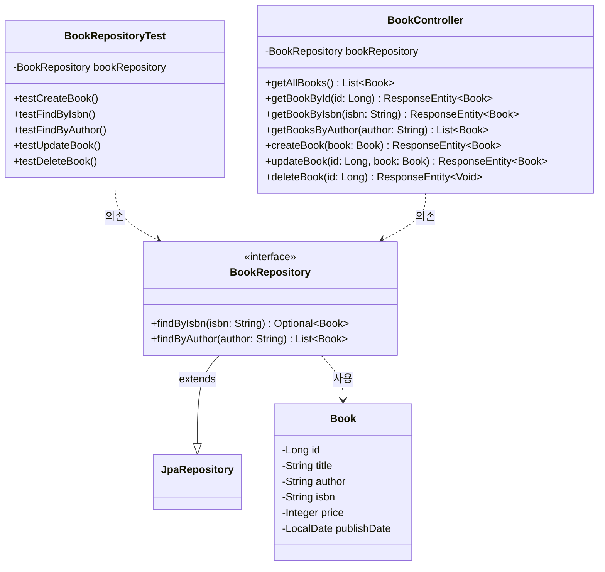

# [실습2-1] Entity, Repository, Test케이스 작성

**요구사항:**
* Book 엔티티, BookRepository 인터페이스를 작성하세요.
* Book 엔티티: `id(Long)`, `title(String)`, `author(String)`, `isbn(String)`, `publishDate(LocalDate)`, `price(Integer)`
* BookRepository: `findByIsbn(String isbn)`, `findByAuthor(String author)` 메소드 추가
* BookRepositoryTest 클래스에서 아래의 테스트 케이스를 구현하세요:
    * 도서 등록 테스트 ( `testCreateBook()` )
    * ISBN으로 도서 조회 테스트 ( `testFindByIsbn()` )
    * 저자명으로 도서 목록 조회 테스트 ( `testFindByAuthor()` )
    * 도서 정보 수정 테스트 ( `testUpdateBook()` )
    * 도서 삭제 테스트 ( `testDeleteBook()` )

---

## 1. 클래스 다이어그램 (Class Diagram)



---

## 2. 데이터베이스 스크립트 (MariaDB)
이 부분은 내가 직접할꺼니깐 gemini-cli는 신경쓰지 않아도 되는 부분이다.
이런식으로 작성할꺼라는 것만 참고하면 된다.
```sql
-- root 계정으로 접속 후 실행
show databases;
use mysql;

-- lab_db 생성 및 권한 부여
create database lab_db;
CREATE USER 'lab'@'%' IDENTIFIED BY 'lab';
GRANT ALL PRIVILEGES ON lab_db.* TO 'lab'@'%';
flush privileges;
select user, host from user;
exit;

-- lab 사용자 계정으로 접속
-- mysql -u lab -plab
-- use lab_db;
```

---

## 3. 소스 코드 구현

### 3.1 Entity: `Book.java`

```java
package com.rookies3.myspringbootlab.entity;

import jakarta.persistence.*;
import lombok.*;
import java.time.LocalDate;

@Entity
@Table(name = "books")
@Getter @Setter
@NoArgsConstructor
@AllArgsConstructor
@Builder
public class Book {
    @Id
    @GeneratedValue(strategy = GenerationType.IDENTITY)
    private Long id;

    private String title;
    private String author;
    private String isbn;
    private Integer price;
    private LocalDate publishDate;
}
```

### 3.2 Repository: `BookRepository.java`

```java
package com.rookies3.myspringbootlab.repository;

import com.rookies3.myspringbootlab.entity.Book;
import org.springframework.data.jpa.repository.JpaRepository;
import org.springframework.stereotype.Repository;

import java.util.List;
import java.util.Optional;

@Repository
public interface BookRepository extends JpaRepository<Book, Long> {
    Optional<Book> findByIsbn(String isbn);
    List<Book> findByAuthor(String author);
}
```

### 3.3 Test: `BookRepositoryTest.java`

```java
package com.rookies3.myspringbootlab.repository;

import com.rookies3.myspringbootlab.entity.Book;
import org.junit.jupiter.api.DisplayName;
import org.junit.jupiter.api.Test;
import org.springframework.beans.factory.annotation.Autowired;
import org.springframework.boot.test.autoconfigure.orm.jpa.DataJpaTest;

import java.time.LocalDate;
import java.util.List;
import java.util.Optional;

import static org.assertj.core.api.Assertions.assertThat;

@DataJpaTest
public class BookRepositoryTest {

    @Autowired
    private BookRepository bookRepository;

    @Test
    @DisplayName("도서 등록 테스트")
    void testCreateBook() {
        Book book = Book.builder()
                .title("스프링 부트 입문")
                .author("홍길동")
                .isbn("9788956746425")
                .price(30000)
                .publishDate(LocalDate.of(2025, 5, 7))
                .build();

        Book savedBook = bookRepository.save(book);

        assertThat(savedBook.getId()).isNotNull();
        assertThat(savedBook.getTitle()).isEqualTo("스프링 부트 입문");
    }

    @Test
    @DisplayName("ISBN으로 도서 조회 테스트")
    void testFindByIsbn() {
        String isbn = "9788956746432";
        bookRepository.save(Book.builder().title("JPA 프로그래밍").author("박둘리").isbn(isbn).build());

        Optional<Book> foundBook = bookRepository.findByIsbn(isbn);

        assertThat(foundBook.isPresent()).isTrue();
        assertThat(foundBook.get().getAuthor()).isEqualTo("박둘리");
    }

    @Test
    @DisplayName("저자명으로 도서 목록 조회 테스트")
    void testFindByAuthor() {
        bookRepository.save(Book.builder().title("Book 1").author("홍길동").build());
        bookRepository.save(Book.builder().title("Book 2").author("홍길동").build());

        List<Book> books = bookRepository.findByAuthor("홍길동");

        assertThat(books).hasSize(2);
        assertThat(books.get(0).getAuthor()).isEqualTo("홍길동");
    }

    @Test
    @DisplayName("도서 정보 수정 테스트")
    void testUpdateBook() {
        Book book = bookRepository.save(Book.builder().title("원래 제목").build());

        book.setTitle("수정된 제목");
        Book updatedBook = bookRepository.save(book);

        assertThat(updatedBook.getTitle()).isEqualTo("수정된 제목");
    }

    @Test
    @DisplayName("도서 삭제 테스트")
    void testDeleteBook() {
        Book book = bookRepository.save(Book.builder().title("삭제할 도서").build());

        bookRepository.delete(book);
        Optional<Book> deletedBook = bookRepository.findById(book.getId());

        assertThat(deletedBook).isEmpty();
    }
}
```

---

## 4. 테스트 케이스 샘플 데이터

| title | author | isbn | price | publishDate |
| :--- | :--- | :--- | :--- | :--- |
| "스프링 부트 입문" | "홍길동" | "9788956746425" | 30000 | 2025-05-07 |
| "JPA 프로그래밍" | "박둘리" | "9788956746432" | 35000 | 2025-04-30 |